# Guide To The PD40

The PD40 is a 40% ortholinear keyboard that I designed and built from scratch.
It has a 3D printed case, has Bluetooth BLE capability, runs the QMK firmware, and uses Kailh Choc low profile switches.
It is now my everyday keyboard that I use whenever I am at a computer.

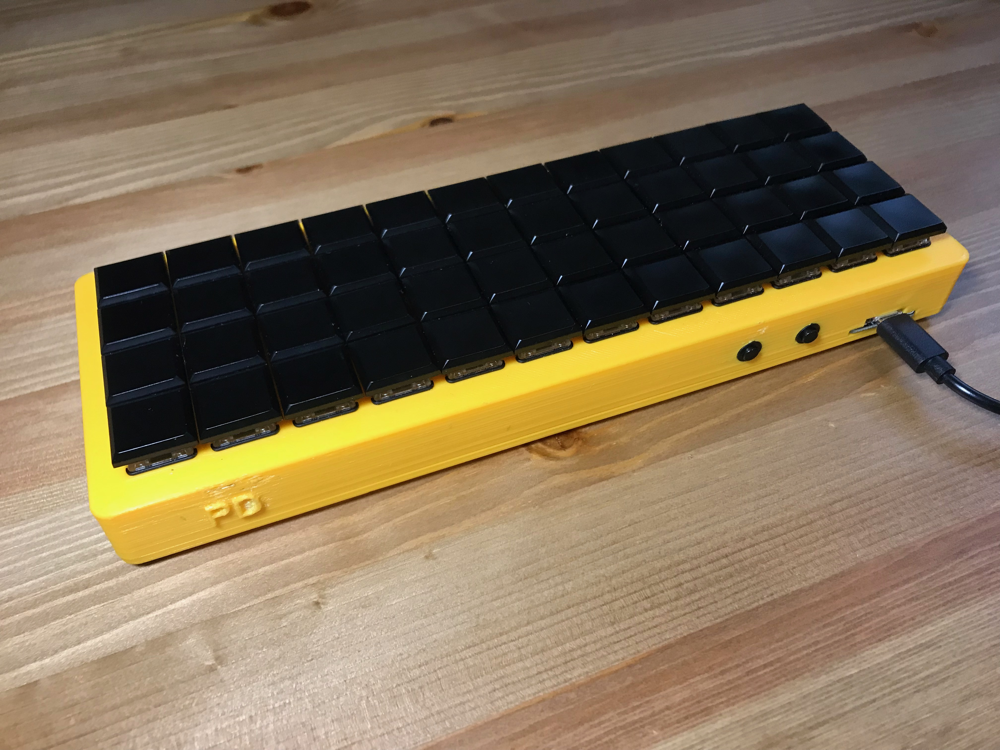

This is my first mechanical keyboard of any type.
I started this project with very little knowledge of the process involved in building a mechanical keyboard, but I have learned so much and had a lot of fun (and some frustration) with this project!

This guide will cover the process of building my keyboard from start to finish and hopefully demystify each step of the process for someone who, like me, is building a keyboard for the first time.

## Why Did You Build Your Own Keyboard?

Whenever I tell people that I built a keyboard the general reaction is "Wha...?!" so maybe this will answer the "...?" part of that.
As with a lot of projects, I started this one because I wasn't happy with my everyday typing experience on my standard off-the-shelf keyboards.
I was (and still am) working as a software developer and writing code every day.
If you have any experience writing code, you know that it makes extensive use of parentheses, brackets, braces, semicolons and other special and not so common characters on the keyboard.
I did not know how to touch type and it was getting frustrating to miss the correct key and have to go back to make corrections all the time.
This slowed down my typing and my though process while writing code.
My first attempt to fix this problem was to learn touch typing.
I used the tutorials on [typingclub.com](https://www.typingclub.com/) and spent a couple weeks working on the lessons for a little bit each day.
I am still not a super fast typist, but I am faster than the average, and more importantly, the lessons achieved their goal of allowing me to type anything without looking at the keyboard.
This was a good first step but after a few more weeks of working like this I was starting to notice more problems.
Now that I was using the correct finger for each key, my right pinky was getting used a lot (because of all the special characters) and ended up tired by the end of the day while other fingers were being under utilized.
I had heard about the Planck keyboard a while ago and the idea of moving the keys to my fingers instead of my fingers to the keys was starting to sound pretty interesting to me.
I looked into buying a keyboard, but it turns out that buying mechanical keyboards or their parts is a very good exercise in patience.
As well, nothing really matched exactly what I wanted and since I was going to spend a fair bit of money on this I wanted to have the keyboard match my preferences as much as possible.
This is why I decided to build my own.
Initially I was pretty intimidated because I though I would have to design a PCB, but when I learned about handwired keyboards I was confident I had the skill to do it.

## Getting Materials

Once I knew I wanted to build a 40% ortholinear keyboard I needed to get the parts for it.
This step also financially committed me to the project.
I learned that buying keyboard parts can take a large portion of your time because how much research is involved.
I went with what I would consider the easy route and bought pretty much everything I needed from (Adafruit)[https://www.adafruit.com/].
The hard route would be buying all sorts of custom and limited run parts, mainly from group buys.
Group buys take a lot of time to arrive and even knowing about them in the first place requires you to keep a pretty close eye on the mechanical keyboard community.
It was nice to buy most of the parts from one place, and Adafruit has normal shipping times unlike a lot of keyboard part vendors.
Additionally, Adafruit actually had stuff in stock which was uncommon at the time I was doing this project.

The following table is all the parts that I bought that went into making the keyboard.
It does not include any tools and consumables that I purchased or already had.
I am not listing prices in this table because they would vary too much based on things like shipping and conversion to your country's currency.
You can see the prices for most of these items on the Adafruit website.

| Part                                                     | Quantity |
|----------------------------------------------------------|----------|
| Adafruit Feather 32u4 Bluefruit LE                       | 1        |
| Lithium Ion Battery - 3.7v 2000mAh                       | 1        |
| Kailh CHOC Low Profile Red Linear Key Switches - 10-pack | 5        |
| Black Kailh CHOC Slim Key Caps x 10 pack                 | 5        |
| USB cable - USB A to Micro-B (3 foot long)               | 1        |
| Mini On/Off Push-Button Switch                           | 2        |
| Little Rubber Bumper Feet - Pack of 4                    | 1        |
| 1N4148 Signal Diode - 10 pack                            | 5        |
| No.6 1/2" countersunk screws (top looks like a triangle) | 6        |
| Small wire (approx 24 awg)                               | 6 meters |

Because I was planning to model the case myself and have it 3D printed, I found it was necessary to buy all the other parts before I really made progress on the modelling.
It is just so much easier to make the model when you have the parts in front of you to measure and visualize how they will all fit together.

Here is a list of all the physical tools I used to build the keyboard:
- Vernier callipers
- Normal tweezers
- Curved tweezers
- Reverse tweezers
- Exacto/sharp utility knife
- Drill
- Drill bit (9/32")
- Screwdriver that fits the head of the screws
- Screwdriver bit for the drill (and that fits the head of the screws)
- Soldering iron
- Solder
- Solder removal braid/wick
- Electrical tape
- Multimeter

## Designing The Case

### Design Goal

The main goal I wanted to achieve with the case design was to avoid permanently attaching any parts to the keyboard case.
This means that it is possible to take all the parts out of the case in a non-destructive manner.
I wanted to do this to increase the modifiability and upgradeability of the design.
Also, I wanted to give myself as much room for error as possible since this was my first keyboard.
The last thing I wanted was to have a situation where I permanently glued something only to find out I could no longer reach a part of it that I needed to get to.

I achieved this goal by using a sandwich design for the case.
When the case is open, all the parts can be moved very easily.
When the case is closed, all the parts are held securely in place by supports attached to the top and bottom of the case.

### 3D Modeling

Coming into this I had no previous experience with 3D modelling but I did have a lot of experience with 2D drafting using AutoCAD at work.
I thought learning the basics of 3D modelling was going to be easier than it actually was. I watched many YouTube videos and read a lot of tutorials before I finished designing the case.

I choose to use (FreeCAD)[https://www.freecadweb.org/] to make the design for two main reasons.
The first is that it is open source software.
I try to make a point of using open source software because of the principles behind it and because I support those ideas.
Of course it has the added benefit of not costing any money.
The second reason is because FreeCAD's workflow is built around parametric modelling.
This means that the model is built from a set of measurements and constraints which makes it easy to go back and change an earlier part of the design without having to redo all of the features that came after it.

If you are going to model your own case, I highly recommend buying a set of vernier callipers to help in making accurate measurements of small and weirdly shaped parts.
You do not need fancy ones; mine are a simple analog set that is only accurate to 0.1 of a mm (and I'm pretty sure it also has a 0.1 mm offset in the calibration).
I also found [this 3D model](https://grabcad.com/library/kailh-low-profile-mechanical-keyboard-switch-1) of a Kailh Choc switch which was really useful for taking measurements.

I am by no means a FreeCAD expert, but I will try and synthesize what I learned about the workflow here.

First off, pretty much all the work will be done in the PartDesign workbench.
Don't get this confused with the Part workbench.
In FreeCAD, a workbench is just a set of tools to use to work on the model.
Switching the workbench does not affect the model.

The general idea of creating a part is to draw a sketch and then extrude or pocket it.
Repeat this until the whole part is designed.
Of course there are a few more things to watch out for and I will talk about those in a moment.
To start the keyboard case, I drew a rectangle on the XY plane and extruded it by 3 mm.
I then drew a square for each switch hole and used the pocket tool to remove material from the first rectangle.
Then I drew a second square around each switch hole that was the same length but slightly wider.
I pocketed this second square just slightly less than the first to create the overhang that the switch clips in to.
I followed a similar process to create the walls, internal supports, and the openings for the buttons and the microcontroller.

Once I created the case from extruding and pocketing sketches, there were a few decorative touches to do.
Chamfering does not start with a sketch in FreeCAD, but instead works by selecting an edge to chamfer and them setting the radius of the chamfer.
I chamfered the edge of the case to avoid sharp edges rubbing my hand while typing.
I also filleted a couple of edges.
Fillet works by selecting the edge to fillet and then setting the depth of the two dimensions.
I used this feature to create ramps on the extrusions of the bottom plate that would fit around the switches and the battery.
This was to help with closing the case once all the parts were installed; if everything wasn't lined up perfectly the ramps would help to push the parts into place as the case was closed.
I also used fillets on a concave corner to provide more support for the button backstops so there was no risk of breaking the backstop when pushing the button.

## 3D Printing The case

Before I got the whole case printed, I made some test prints of specific parts of the design to make sure that they would work on a 3D printer.
I made these test prints at my local library where they offer free use of a 3D printer with the limitation that prints cannot be longer than 3 hours.

The first test I did was to test the holes for the switches.
I wasn't sure what sort of tolerances I needed for the switches to have a snug fit but not be impossible to put in the hole.
I printed a small grid of 4 holes, each a slightly different size.
This test was very informative because I got the information that I needed for the hole size and some additional information.
It was also a good test of the spacing between the holes to see if the keycaps would have an appropriate space between them.
My goal was to make this space as small as I could so my fingers had to travel less over the keys.
The test confirmed that the spacing I had measured would work in the 3D print.
The other reason this test was informative was because it tested the thickness of the top plate.
I needed the top plate to be thick enough so it would provide a sturdy typing surface and so the supports between the switches would not break while pushing the switches in.
I didn't have a very quantitative way of measuring this but I thought my design would be thick enough based on the qualitative feel of the test print.

The second test print I did was to test the screw holes for connecting the top and bottom plates together.
I needed to check a few things with this test. First, I had to get the right size for the internal diameter of the screw hole.
The hole had to be small enough so that the screw could cut threads in it and get enough grip, but not so small that there wouldn't be enough space for the extra material that cutting the threads would generate.
Secondly, I had to test that the outside diameter of the screw hole was big enough so the material had enough support and did not split when the screw was threaded into it.
Third, I needed to make sure the countersink holes on the bottom plate were the right shape so the screws would sit flush with the bottom plate and not pose any risk of scratching the surface the keyboard was resting on.
My first print of this test did not work super well: the internal diameter was too small and it made getting the screw in really difficult.
Also, the countersink hole was a little too small and the screw did not quite sit flush.
I did a second print of this test with a larger internal diameter and a larger countersink hole which was more successful; the measurements from this test are the ones I went with in the final design.

I got the full case printed by looking on Kijiji for people offering 3D printing services in my area.
I found a student at the local university who had a printer big enough to fit the case so he printed it for me and I picked it up from him.

The top plate of the case was able to be printed "upside down" so that the surface you would type on was on the bed of the printer.
This minimized any bridging in the print.

Once I got the case from the printer, there was some cleanup work to be done on it. The printer had left lots of stringy bits so I used a sharp utility knife to cut those off and make it look better.
There was also an issue printing the initials on the side of the case so I had to spend a bit of time cutting away some extra material to carve out the letters.
The two holes for the buttons did not print very well either, and because there was extra material, the buttons would not fit.
To fix this, I used a drill to carefully drill out the holes to the right size.
This worked really well and if I were to do this again I would probably print the holes in a smaller size on purpose and then use successively larger drill bits until the buttons had a snug fit.
The final issue with the printing was caused by having the typing surface face down on the bed.
The first layer of the print spread a bit more than it should have so the hole were slightly smaller than designed; you could even see the small ridge of extra material if you looked closely.
This extra ridge prevented the switches from fitting in the hole so I had to shave the extra material off each edge of each hole.
This was not hard but it did get pretty tedious by the 48th hole.

Finally, to get the case completely ready for assembly, I had to thread the holes for the screws.
I figured I would do this before assembly in case something went wrong and ruined the case.
I carefully used the drill for this because it gets quite hard to turn the screw near the end of threading the hole.
You can probably do it with a screwdriver if absolutely necessary.
Using the drill, I placed a screw over the hole and tried to hold it as straight as possible while slowly drilling it in.
I did this without the bottom plate so it would not get in the way, and so it was easier to tell if the screw was going in straight.
Once each hole was threaded, I took all the screws back out.

## Assembling The Keyboard

Once the case was all cleaned up and I had all the parts I needed, it was time to assemble the keyboard.

### Step 0: Test The Parts

This step is not essential but it is a very good sanity check for later in the project.
It is very unlikely that there would be an issue with a switch or a diode, but it is better to find out before you solder them into the case.
This way, if something is not working, you can eliminate the functionality of the switch or diode as a potential cause.
I tested the parts by using the continuity setting of my multimeter.
Remember that the switch has to be pressed to test continuity, and the multimeter probes need to be on the correct sides of the diode to test continuity.

### Step 1: Put All The Switches In Their Holes

The first step is to plug all the switches into the holes.
I aligned all the switches the same way so that the pins on the bottom of the switches were all in the same positions.
This makes it easier to visualize the matrix circuit that will connect all the switches and helps to avoid errors when wiring them together.

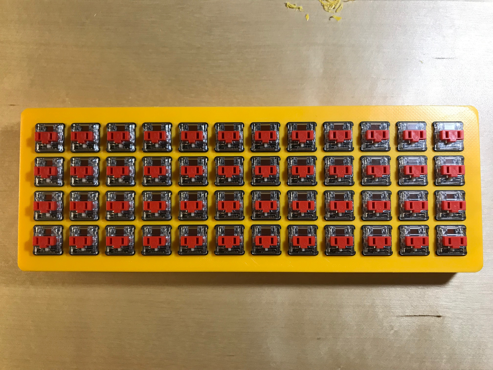

### Step 2: Put The Keycaps On The Switches

This step is also quick.
Just plug the keycaps into the switches.
It did take more force than I thought, but the case held up fine.
This step does not necessarily have to happed second.
I thought it would be easier to work on the case while it was upside down if the keys were there to provide more support, but doing this also introduces a risk of scratching the keycaps.

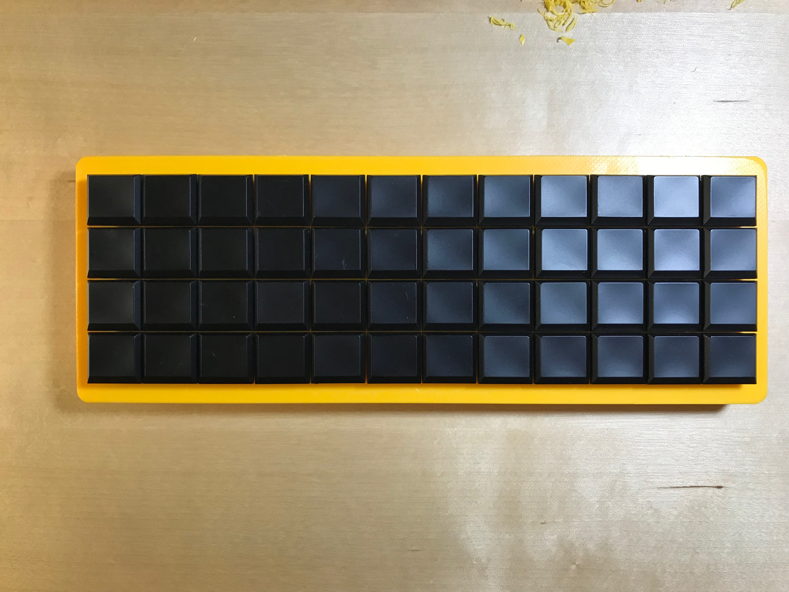

### Step 3: Bend The Diodes

I followed the technique of using the legs of the diodes to form the rows of the matrix. This keeps the wiring looking neat and reduces the amount of solder joints (and therefore reduces the amount of potential failure points).
To make it easy to solder the diodes, I bent them all to the correct shape first.
I used an extra switch that wasn't in the case as my jig.
This is a good way to make sure that all the diodes are bent the same and to be sure they will fit with the switches.

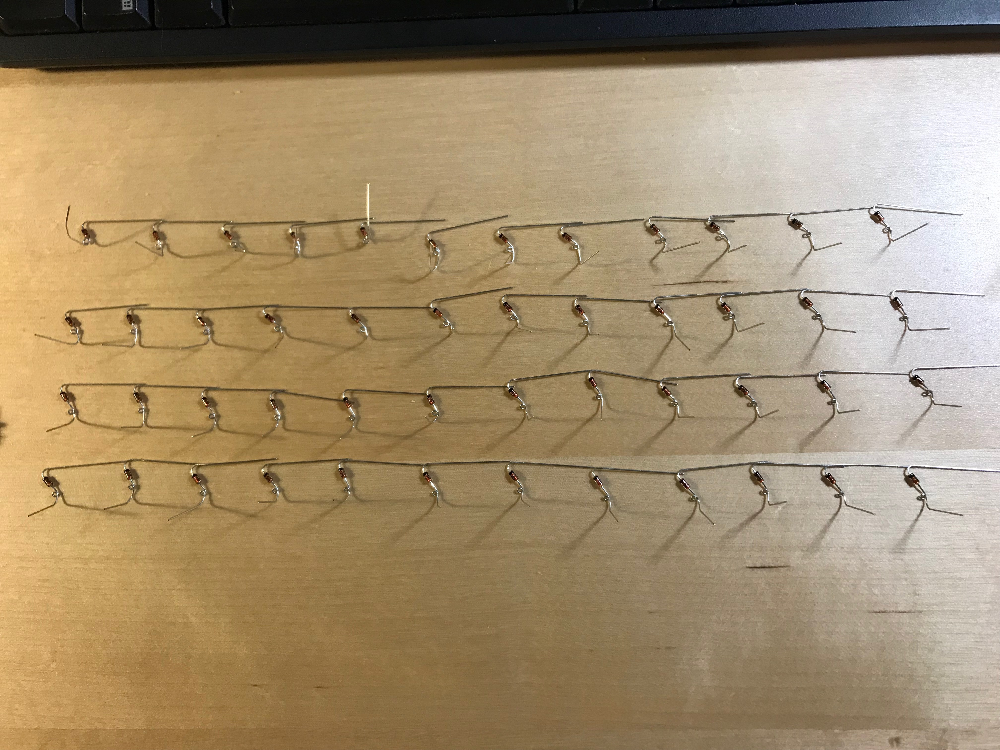

### Step 4: Solder The Anodes Of The Diodes

Start installing the diodes by soldering the anode side first.
This secures them to the switches in the case and keeps them steady when making the matrix rows.
At this point, you can cut off the rest of the anode to avoid getting poked by it.
I would not recommend cutting the anode sooner as it can be a helpful handle to hold the diode and get it positioned in the right place.

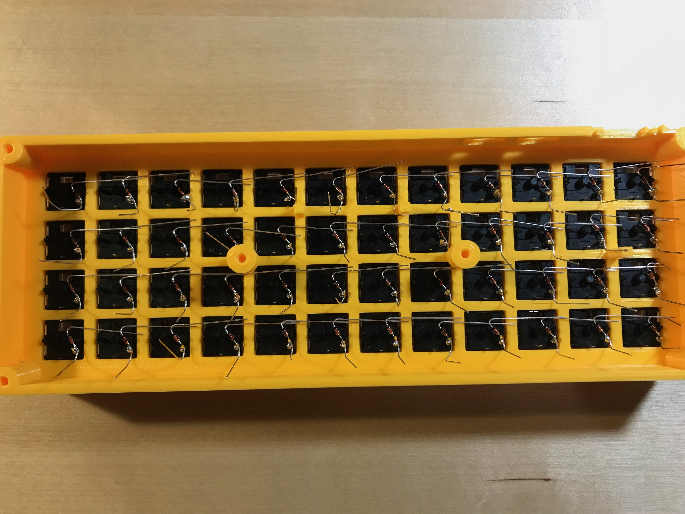

### Step 5: Solder The Cathodes Of The Diodes

To make the rows of the matrix, solder the cathodes of each conesecutive diode together.
I first used two pairs of tweezers to "weave" the cathodes together by looping one around the other.
Doing this keeps them in the right position while soldering.

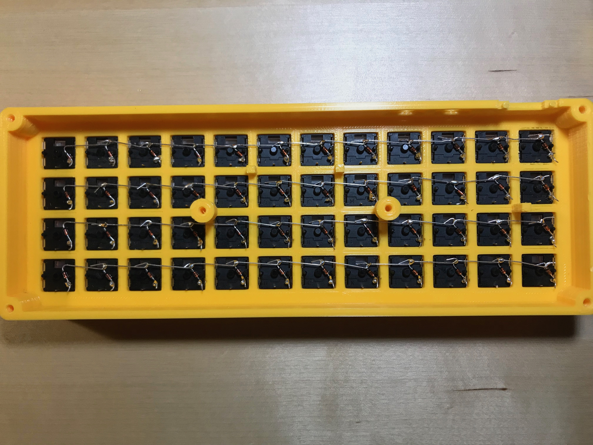

### Step 6: Prepare The Wires To Connect The Columns

I tried to do the technique of using a singe wire for each column, but I found it was too difficult to strip the wire in the middle without accidentally cutting it.
Additionally, I found that I needed to make a loop in the wire and place the loop around the switch pin to get a good solder connection, and making 4 loops in one wire all line up with the pins was challenging.
Because of this, I used 3 individual wires for each row.
Once I figured out the length of the wire segment and where I needed to strip it, I used a template (just a couple lines I drew on a piece of paper) to speed up the process.
I made the loops at the end of the segment by grabbing the very end of the wire with tweezers and twisting it around.

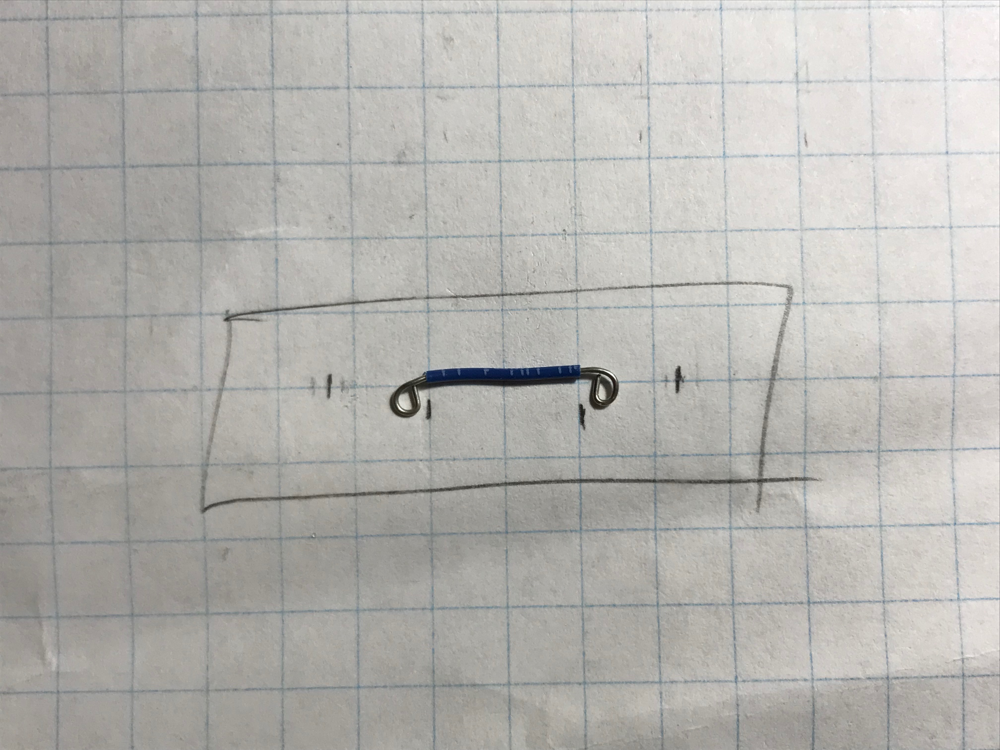

### Step 7: Solder The Rows

Next step is to solder on the wire segments that make up the rows.
I left the last pin in the row unsoldered because that is where the wire back to the microcontroller will connect.

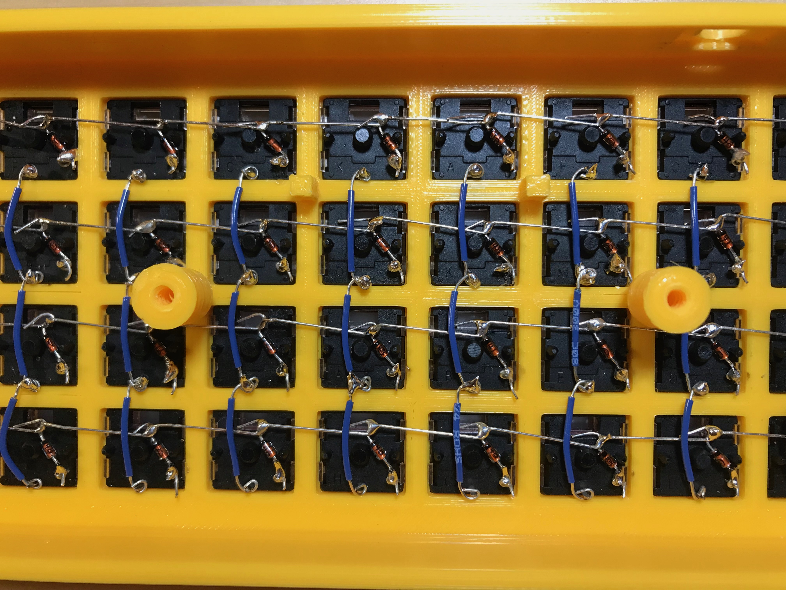

### Step 8: Prepare The Wires To Connect Rows And Columns To The Microcontroller

I made rough eyeball estimates for how far each wire would need to reach to get to each row and column.
I wanted to leave a little bit of slack so I could move the microcontroller around and access both sides of it.

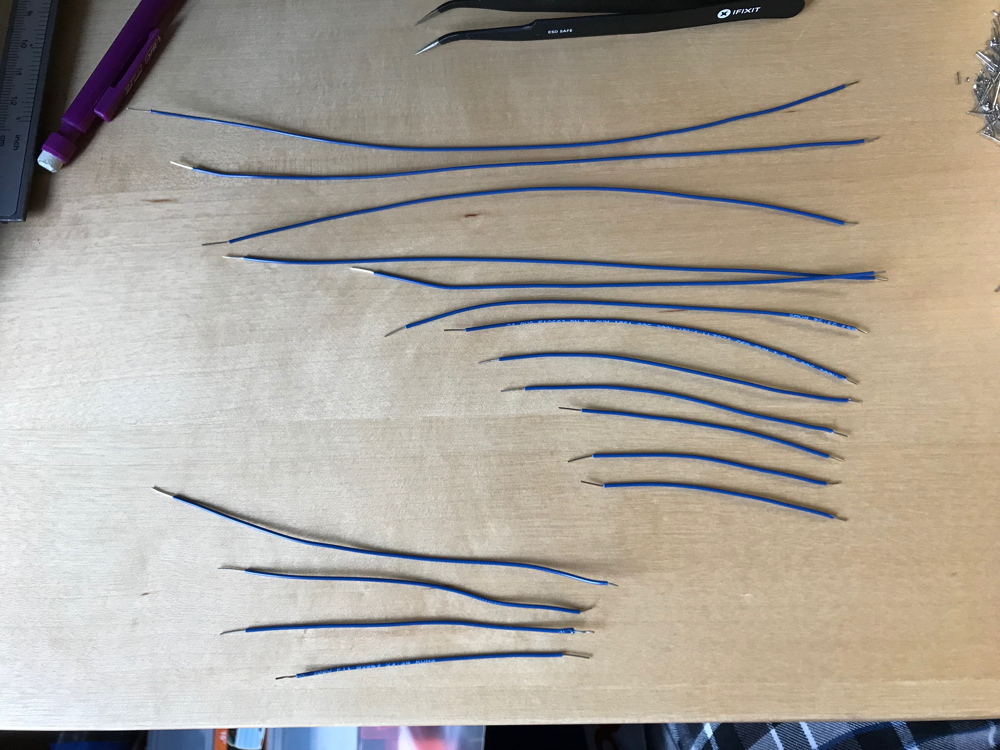

### Step 9: Solder The Wires To The Microcontroller

To make the soldering as easy as possible, I soldered the wires to the microcontroller while it was outside the case and easy to access.
It is necessary to hold the microcontroller off the work surface so that the pin holes are not blocked.
Usually this would be done with soldering "helping hands" but I didn't have those so I used a pair of tweezers that closed in reverse.
I put a weight on the handle of the tweezers so the whole setup was more sturdy and the microcontroller wouldn't move as soon as I bumped it with my soldering iron.

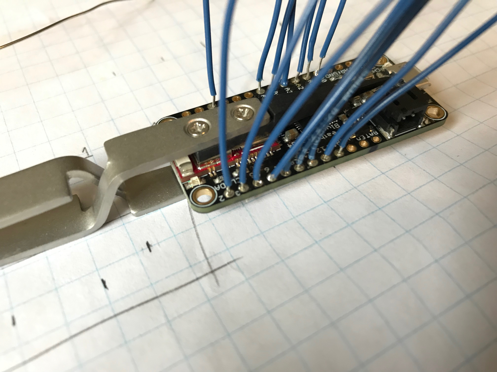

### Step 10: Solder The Microcontroller Onto The Matrix

Make loops in the end of each wire coming from the microcontroller and solder each wire to its respective row or column.
It doesn't matter which part of the row or column the wire connects to.
I connected all the wires to the ends of the rows and columns just for consistency.

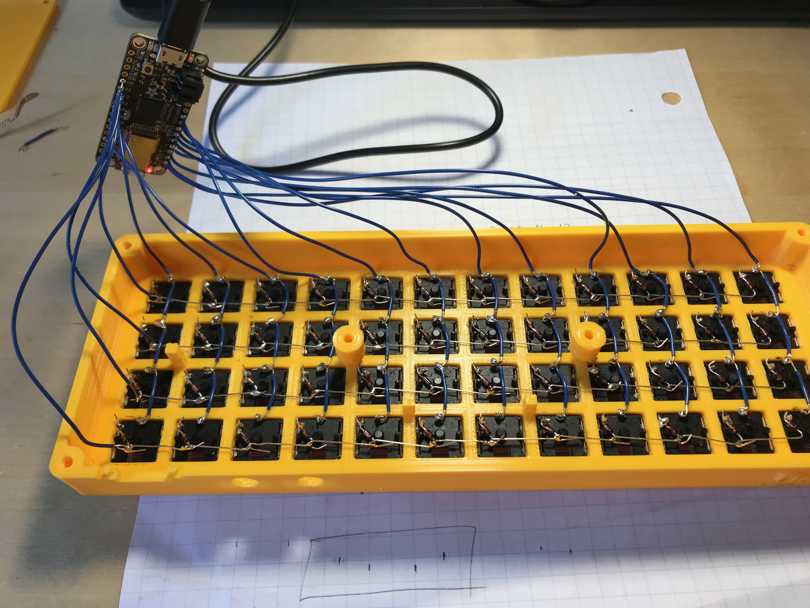

### Step 11: Make The Inline Battery Switch

To be able to turn the keyboard on and off while using bluetooth, there needs to be a switch.
The switch is placed inline with the positive (live, red) wire of the battery.
To install the switch, cut the positive wire of the battery in the middle and strip a bit of casing off each side of the cut.
Loop each side of the cut to one terminal of the switch.
I bent the terminals of the switch so that they pointed straight back instead of off to the sides; this made the switches fit better in the case.
It doesn't matter which side of the cut goes to which side of the switch.
If you are using the same battery as I did, the wire will be stranded instead of solid core.
Be careful not to let the end of the wire fray too much before you have it looped around the switch terminal, fraying makes it difficult to work with.
Solder the wire to the switch and plug the battery into the microcontroller.

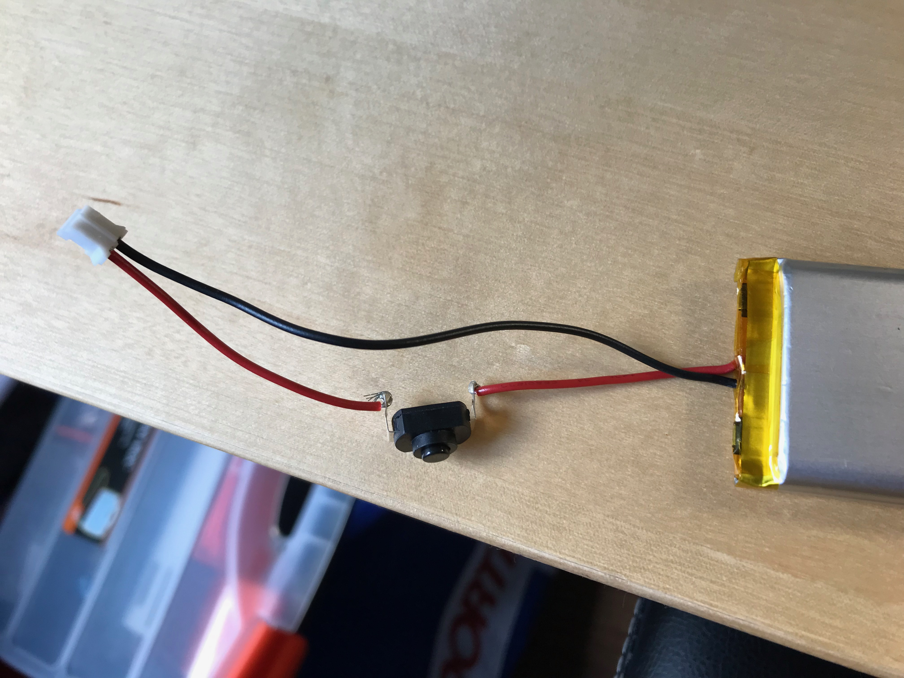

### And That's It!

Now the keyboard is fully assembled!

At this stage, I would recommend testing all the solder joints with a multimeter.
This will keep you sane if there is any debugging to do in the software.
I tested all the joints with my multimeter but still had issues with loose solder connections.
If there is an issue on the board that affects part of a row or column, it is likely that the issue is a loose solder connection somewhere along the row or column.

Don't put the bottom plate on yet, wait until you have the software working and have tested each switch.
This makes it much easier to access the soldering joints when you find some that are loose.
Once the software is working and every switch has been tested, screw on the bottom plate and add the rubber feet.

## Writing The Software

I used the QMK firmware to program my keyboard.
It is the obvious choice since it is a mature firmware, it is already used in pretty much every DIY keyboard, and it is even used in a number of commercial keyboards.
Additionally, using QMK will allow others to easily reuse my work if they want to use or extend it for their own project.
You can find my fork of QMK [here](https://github.com/peter-dye/qmk_firmware).

### Getting Set Up

I followed the [setup guide](https://docs.qmk.fm/#/newbs_getting_started) with minimal troubles on macOS.
If you are only working on one keyboard, I would highly recommend doing the optional Step 5 of configuring the build environment.
One issue I ran into was one of the required dependencies not being available from homebrew.
To solve this I found it online, installed it manually, then added the install location to my path so that QMK could find it.

If you just want to make a new keymap for the PD40 (or any other keyboard), this is [well documented in the QMK docs](https://docs.qmk.fm/#/newbs_building_firmware) so you can follow the steps there.
If you want to learn about making your own keyboard from scratch, keep on reading!

### Starting A New Keyboard

Surprisingly, I had a lot of trouble figuring out how to start a new keyboard!
It is not in the quick start guide and all the information I was finding was just talking about makeing new keymaps for already existing keyboards.
Eventually I found the list of all QMK commands, and learned about the `qmk new-keyboard` command.
This command sets up all the files in a default configuration for a new keyboard.
When you run this command to setup your keyboard, choose `avr` as the keyboard type when asked.
Something to watch out for is that it creates the keyboard in the main `keyboards` folder, and since the PD40 is handwired I moved the folder for it to the `keyboards/handwired` folder.

When I started writing the QMK firmware for my keyboard, I was a little overwhelmed with all the possible settings.
Here are the settings that I needed to change from the default to make the software work on the Adafruit Feather 32u4 and to enable all the functionality that I wanted:
- `MATRIX_ROWS`, `MATRIX_COLS`, `MATRIX_ROW_PINS`, and `MATRIX_COL_PINS` in `config.h`. More on these later.
- `SOFT_SERIAL_PIN` in `config.h`: commented out this line.
- `F_CPU = 8000000` in `rules.mk`: added this line after the `MCU` option. This line is essential to the firmware working on the Feather.
- `BOOTLOADER` in `rules.mk`: modified to `caterina`. This line is essential to the firmware for flashing to the Feather.
- `BLUETOOTH = AdafruitBLE` in `rules.mk`: added this line to the bottom of the file. As you might expect, it is needed to enable bluetooth functionality.
- `DYNAMIC_MACRO_ENABLE = yes` in `rules.mk`: added this line to the bottom of the file.
- Most of the contents in `keymap.c`, `info.json`, and `pd40.h` (or `name_of_your_keyboard.h`). More on these files and their changes later.
You can also modify the `readme.md` files with whatever content you think should be included.

The next thing to do is to assign the hardware pins to the columns and rows.
To see what pins are available, look at the [pinout diagram](https://learn.adafruit.com/adafruit-feather-32u4-bluefruit-le/pinouts) for the Feather.
Most of the Port Pins (the ones that start with a `P`) are available to be used with a few exceptions.
There are six pins that are used by the bluetooth module, so if you want to have bluetooth working properly, there cannot be anything connected to these pins.
The first three (`PD4`, `PE6`, `PB4`) are not actually accessible without disassembly so there is nothing to worry about there.
The second three (`PB1`, `PB2`, `PB3`) are accessible, but they have a bluetooth symbol beside them on the pinout diagram so you know not to use them.

Other than the mentioned pins, it doesn't matter what pin goes to what row or column as long as the wiring copies what is set in the software.
Define what pins go to which row and which column in the `MATRIX_ROW_PINS` and `MATRIX_COL_PINS` preprocessor definitions.
When specifying the pins, the `P` can be omitted.
For example, pin `PF7` would just be specified as `F7`.
The index of the array where the pin is specified is which column or row it corresponds to.
So the first pin specified in the `MATRIX_ROW_PINS` array would correspond to the first row of the matrix, which physically maps to the top row of the keyboard.

### Making A Keymap For A New Keyboard

Now that the infrastructure is setup, the keymap needs to be defined.
This starts in `info.json`.
The easiest way to setup this file is to follow the same pattern as the sample content.
What this file does is assign names to the keys at each position of the matrix.

The next step to making the keymap is to change `name_of_your_keyboard.h`, specifically the `LAYOUT` macro.
This macro allows you to input keycodes as arrays, and it will map these keycodes to the names of the keys.
And in the previous step, we just mapped the names of keys to physical locations in the matrix.
This is how the firmware knows what keycode to send when a certain key is pressed.
Another advantage of this approach is that the format of the keycodes can look different from the layout of the matrix, and the `LAYOUT` macro will map everything properly (if you set it up of course).
Once again, changing this from the example to what you want for your keyboard is a simple matter of following the same pattern and using the names of the keys you defined in `info.json`.

Finally the last step is to assign actual keycodes.
This is done in `keymap.c`.
Once again you can pretty easily follow the pattern from the example code to setup your keycodes on the correct keys.
You can find a list of all the keycodes built into QMK [here](https://docs.qmk.fm/#/keycodes).
Of course, you can also define your own keycodes to do anything you want by following the sample code.
Your custom keycodes don't need to send information to the computer, they can be used for stuff like controlling lighting, changing bluetooth settings, or whatever else you can think of!
You will probably want to play around with your keymap for a while before settling down on what works best for you.
For example, I decided to try putting the `Enter` key under my left thumb, and it has been a very useful spot for it!
Not having to take my hand off the mouse to press `Enter` makes me a lot faster than I expected.

And that's it (although admittedly that is a fair amount of work).
Now you can compile the firmware and flash the board by following the [flashing quide](https://docs.qmk.fm/#/newbs_flashing).
If you run into issue, just be patient and persistent in working through them.
There is a QMK Discord with a big community that will happily answer any questions you might have.

## Getting The Keyboard To Work

Even if your software compiles and flashes properly, it is likely you will still run into issues initially.
I ran into a few issues, and all of them turned out to be caused by the matrix wiring.

I had one issue where a letter was constantly being output, and this was caused by a short between one of the rows and one of the columns.
This was fixed by sticking a piece of electrical tape between the offending row and column.

Most of my issue were caused by loose soldering joints.
This is why I recommend testing them with a multimeter as much as you can.
If a partial or complete row or column is not working, it is likely there is a loose soldering connection somewhere along that row or column.
The loose connection is likely around the division between working and not working keys, or where the row/column connects to the microcontroller if the whole row/column is not working.

## What I Would Change If I Were To Do It Again:

If I were to do this exact project again, I would change a couple design aspects of the case.
The two middle supports that the base plate can be screwed into are much weaker than I anticipated.
In fact, one of them broke off when I was trying to screw on the bottom plate.
Thankfully, the typing surface is more than strong enough without the support from them.
Therefore, I don't think they are necessary and I would remove them.

Another issue is that the bottom plate is bowing downward slightly.
To fix this I would add two more holes for screws along each of the front and back walls of the case.

Because of the resolution of the 3D printer, the edges of the case that are chamfered are still sharper than I would have liked.
I would increase the radius of the chamfer for a smoother edge.

I would also add two more internal supports for the battery on the top plate of the case.
This is so that when the case is upside down and the battery is being positioned so that the bottom plate can be installed, the battery will be stable on four supports instead of wobbling on two supports.

Also, because I was learning FreeCAD as I went, I did not start off the model with the best practices.
I did not know that dimensions could be calculated from other dimensions or from spreadsheets, but if I had it would have made the design much neater, more parametric, and easier to modify.
If you are just starting working with FreeCAD, I would definitely recommend learning this technique.

## The End

Thanks for reading all the way to the end!
I hope this document is helpful to someone new to the mechanical keyboard community and looking to build their first ever mechanical keyboard from scratch.
I would really appreciate a star on this repository, and if you want to contribute or notice something that could be improved, feel free to submit a pull request or open an issue.

Bye!

*This document was typed exclusively on the PD40 keyboard*
